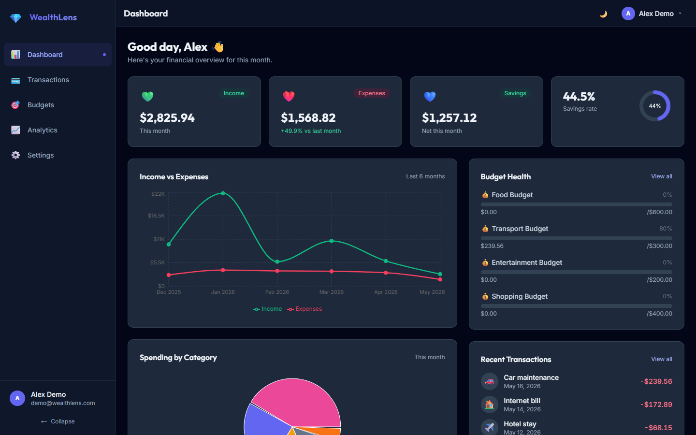

# WealthLens 💎

> A full-stack personal finance tracker — track income, expenses and budgets, visualise spending trends, and import transactions from CSV.

<p align="center">
  
</p>

---

## Tech Stack

<p align="center">
  
  
  
  
</p>
<p align="center">
  
  
  
  
</p>
<p align="center">
  
  
  
  
  
</p>

---

## Features

- **Transaction tracking** — income, expenses, and transfers with categories, tags, and recurring support
- **Budget management** — set spending limits per category with configurable alert thresholds and progress tracking
- **Analytics dashboard** — spending heatmap, trend lines, category breakdowns, and savings rate ring
- **CSV import/export** — 4-step guided import wizard with column mapping; export to CSV at any time
- **Dark mode** — full light/dark toggle, persisted across sessions
- **Fully responsive** — sidebar layout on desktop, bottom nav on mobile

---

## Setup

### 1. Install dependencies

```bash
npm install
```

### 2. Configure environment

```bash
cp .env.example .env.local
```

Edit `.env.local`:

```
MONGODB_URI=mongodb://localhost:27017/wealthlens
NEXTAUTH_SECRET=<run: openssl rand -base64 32>
NEXTAUTH_URL=http://localhost:3000
NEXT_PUBLIC_APP_URL=http://localhost:3000
```

### 3. Seed demo data

Make sure MongoDB is running locally, then:

```bash
npm run seed
```

This creates:

- **15 system categories** with icons and colors
- **1 demo user** — `demo@wealthlens.com` / `demo1234`
- **200 transactions** spread across the last 12 months
- **8 budgets** across different categories

### 4. Start development server

```bash
npm run dev
```

Open [http://localhost:3000](http://localhost:3000) and sign in with the demo credentials.

---

## Demo Credentials

| Field    | Value                 |
| -------- | --------------------- |
| Email    | `demo@wealthlens.com` |
| Password | `demo1234`            |

You can also click **"Use Demo Account"** on the login page to auto-fill.

---

## Project Structure

```
app/            Next.js pages and API routes
  (auth)/       Login + register
  (app)/        Authenticated pages
  api/          REST API handlers
components/     Shared React components
  ui/           Card, Badge, Modal, Skeleton, Toast
  charts/       Recharts wrappers
  transactions/ Transaction-specific components
  budgets/      Budget components
  layout/       Sidebar, Topbar, MobileNav
lib/            Server utilities (db, auth, validations, analytics)
models/         Mongoose schemas
types/          TypeScript interfaces
hooks/          Client data fetching hooks
store/          Zustand global state
scripts/        Seed script
docs/           SDLC documentation (architecture, API spec, schemas)
```

---

## Architecture Notes

- **App Router** — all pages use Next.js 14 App Router. Server Components for layouts, Client Components for interactive UI.
- **API Routes** — all data access goes through `/app/api/*`. No direct DB calls from the browser.
- **Auth** — NextAuth v5 with JWT strategy. Session contains `{ id, email, name, currency }`. Every API route checks the session first.
- **MongoDB** — Mongoose with a singleton connection pattern to survive hot reload in development.
- **Dark mode** — Tailwind `class` strategy. An inline script in `layout.tsx` reads `localStorage` before paint to prevent flash.

---

## Dataset Credit

Seed data structure inspired by the [Kaggle Bank Transaction Dataset](https://www.kaggle.com/datasets/apoorvwatsky/bank-transaction-data).
